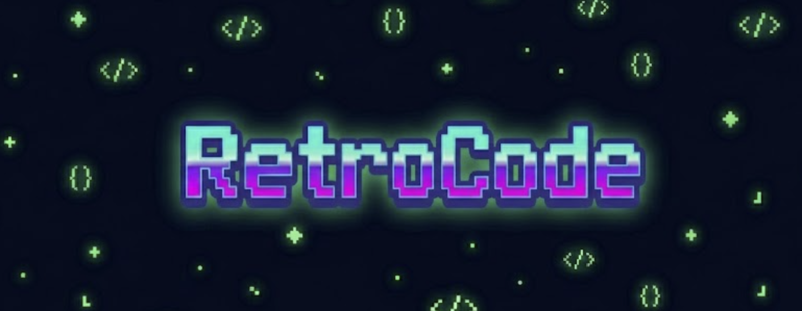

Turn your Claude Code session traces into an auto-updating project playbook.

RetroCode runs as a background daemon, watches your Claude Code conversation history, and uses an LLM to extract patterns and insights — then writes them directly into your project's `CLAUDE.md` so future sessions benefit automatically.

---

## Quickstart

```bash
# 1. Install
git clone <repo-url>
cd RetroCode
pip install -e .

# 2. Set your API key
export COMMONSTACK_API_KEY=your_key_here

# 3. Go to your project and start the daemon
cd ~/my-project
retro --up --dir .

# 4. Watch it work
tail -f .retro/daemon.log
```

That's it. Once enough new conversation rounds accumulate, RetroCode will update `.retro/playbook.txt` and inject the results into your `CLAUDE.md` automatically.

---

## How it works

1. Claude Code stores every session as a `.jsonl` trace in `~/.claude/projects/<project-key>/`
2. RetroCode polls those traces every `poll_interval` seconds
3. A **Reflector** agent analyzes new conversations for patterns, mistakes, and strategies
4. A **Curator** agent adds, modifies, or removes bullets in a structured playbook
5. The playbook is synced into your project's `CLAUDE.md` between two marker comments

---

## Installation

```bash
git clone <repo-url>
cd RetroCode
pip install -e .
```

Requires Python 3.11+.

---

## Usage

```bash
# Start in background
retro --up --dir .

# Start in foreground (see logs live, useful for debugging)
retro --up --foreground --dir .

# Stop
retro --down --dir .
```

---

## Configuration

Drop a `retro_config.yaml` in your project root to override any defaults:

```yaml
daemon:
  poll_interval: 30       # seconds between polling cycles
  min_rounds: 5           # minimum new conversation rounds before triggering update
  pid_file: .retro.pid
  retro_dir: .retro

playbook:
  max_bullets: 40         # hard cap; curator consolidates when exceeded
  default_model: gpt-5.2
  sections:
    CODING_PATTERNS: coding
    WORKFLOW_STRATEGIES: workflow
    COMMUNICATION: communication
    COMMON_MISTAKES: mistake
    TOOL_USAGE: tool
    OTHERS: other
```

If no `retro_config.yaml` is present, built-in defaults are used.

---

## LLM providers

The default provider is **CommonStack**. Set `COMMONSTACK_API_KEY` in your environment and you're done — no extra config needed.

To switch providers, set `LLM_PROVIDER`:

| Provider | `LLM_PROVIDER` | Key env var |
|---|---|---|
| CommonStack *(default)* | `commonstack` | `COMMONSTACK_API_KEY`, `COMMONSTACK_API_URL` *(optional)* |
| OpenAI | `openai` | `OPENAI_API_KEY` |
| Anthropic | `anthropic` | `ANTHROPIC_API_KEY` |
| OpenRouter | `openrouter` | `OPENROUTER_API_KEY` |

The default model is `gpt-5.2`. Override it in `retro_config.yaml` under `playbook.default_model`.

---

## Output files

All intermediate files live in `.retro/` inside your project:

```
your-project/
  retro_config.yaml       # optional config
  CLAUDE.md               # auto-updated (Claude Code reads this)
  .retro/
    playbook.txt          # structured playbook with bullet IDs
    daemon.log            # full daemon logs
    .trace_state.json     # tracks which sessions have been processed
    .retro.pid            # daemon PID
```

The playbook is injected into `CLAUDE.md` between these markers — anything outside is untouched:

```
<!-- retro:start -->
# Playbook
...
<!-- retro:end -->
```

---

## Playbook operations

Each cycle the Curator can perform:

- **ADD** — insert a new insight bullet into a section
- **MODIFY** — update an existing bullet in place (keeps its ID)
- **DELETE** — remove a bullet that is outdated or contradicted

Bullets are capped at `max_bullets`. When exceeded, the curator is told to consolidate (merge or delete) to bring the count down.
